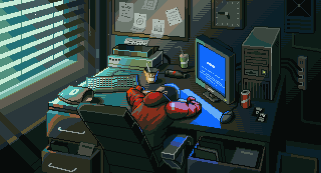

<table style="border: none; border-collapse: collapse;">
<tr style="border: none;">
<!-- LEFT SIDE (TEXT) -->
<td style="vertical-align: top; width: 55%; padding-right: 40px; border: none;">

  

  
Building innovative solutions with modern technologies

  

    
    
  

</td>

<!-- RIGHT SIDE (IMAGE) -->
<td style="text-align: right; vertical-align: top; width: 45%; border: none;">
  
</td>

</tr>
</table>

---

##  Tech Stack

**Languages:**  

**Frontend:**  

**Backend:**  

**Blockchain & Web3:**  

**OS & Tools:**  

---

##  Main Projects

> *These are my primary projects showcasing blockchain development, AI/ML, and full-stack engineering*

---

### 🔷 StreamFi_Project- Algorand Payment Streaming

**Tech Stack:**  

**Description:**  
Real-time cryptocurrency payment streaming platform built on Algorand blockchain with smart contract automation, continuous payment flows, and Docker-based deployment.

🔗 **[View Repository](https://github.com/iceman2100/AlgorandProjects)**

---

### 🔷 FinLit-AI - Financial Literacy Assistant

**Tech Stack:**  

**Description:**  
AI-powered multilingual financial literacy application with voice interaction in Hindi and English, real-time financial news integration, and RAG-based Q&A system.

🔗 **[View Repository](https://github.com/iceman2100/finlit-ai)**

---

### 🔷 Climate_Plan AI

**Tech Stack:**  

**Description:**  
Traditional satellite / city‑station data is too coarse to spot a fire spark, toxic plume, or heat‑stroke hotspot on your block.
Our solution plants low‑cost sensor nodes every 100–250 m, streams the data, and lets AI tell each user—or an entire enterprise—exactly what to do next,and came 1ˢᵗ runner_up in climate_X_Hackathon.

🔗 **[View Repository](https://github.com/iceman2100/Climate_Planner_AI)**

---

### 💡 *"Building the future, one commit at a time"*

